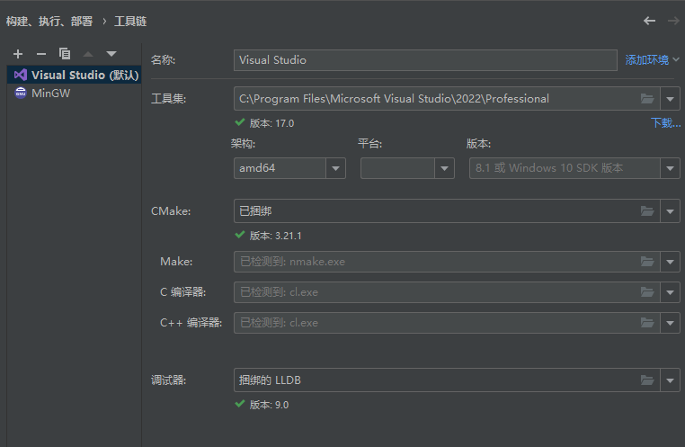
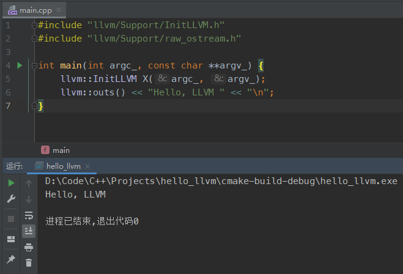
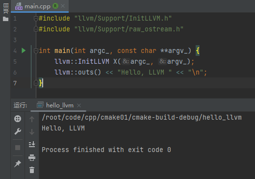

# 安装环境
## Ubuntu下 
使用官方的命令一键完成 [链接直达](https://apt.llvm.org/)
## Windows下 
根据[该教程](https://llvm.org/docs/GettingStartedVS.html) 克隆llvm项目后编译
这里是我编译好的Release和Debug版本的库，X64，
## Hello World

`main.cpp`
```cpp
#include "llvm/Support/InitLLVM.h"
#include "llvm/Support/raw_ostream.h"

int main(int argc_, const char **argv_) {
    llvm::InitLLVM X(argc_, argv_);
    llvm::outs() << "Hello, LLVM " << "\n";
}
```
### Windows下
`CMakeLists.txt`
```
cmake_minimum_required(VERSION 3.21)
project(hello_llvm)

set(CMAKE_CXX_STANDARD 20)
include_directories("D:\\Code\\C++\\Projects\\llvm-project-build\\include\\") # 添加头文件路径
include_directories("D:\\Code\\C++\\Projects\\llvm-project\\llvm\\include\\")
link_directories("D:\\Code\\C++\\Projects\\llvm-project-build\\Debug\\lib") # Debug，添加库路径
#link_directories("D:\\Code\\C++\\Projects\\llvm-project-build\\Release\\lib") # Release
add_executable(hello_llvm main.cpp)
target_link_libraries(hello_llvm LLVMSupport) # Windows，指定库
#target_link_libraries(hello_llvm LLVM) # Ubuntu
```
#### Clion工具链


#### Clion构建配置


#### 运行结果



### Ubuntu下
`CMakeLists.txt`
```
cmake_minimum_required(VERSION 3.21)
project(hello_llvm)

set(CMAKE_CXX_STANDARD 20)
include_directories("/usr/include/llvm-14/") # 添加头文件路径
include_directories("/usr/include/llvm-c-14/") # 添加头文件路径
link_directories("/usr/lib/llvm-14/lib/") # 添加库路径
add_executable(hello_llvm main.cpp)
target_link_libraries(hello_llvm LLVM) # Ubuntu
```

